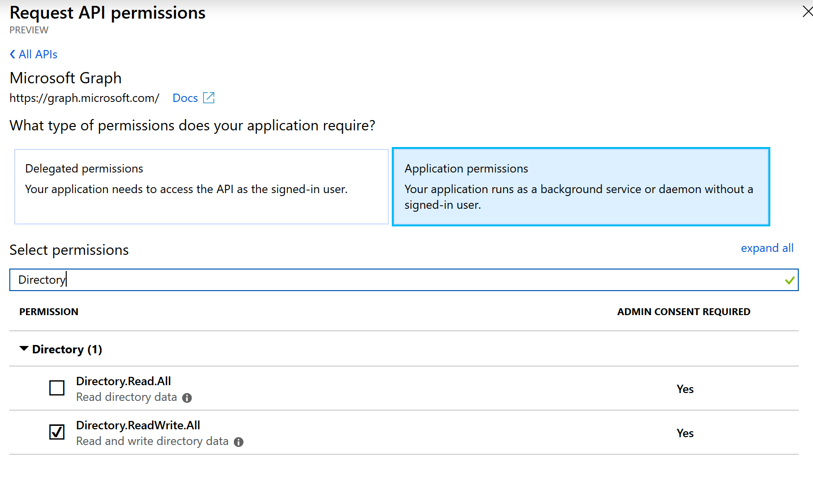
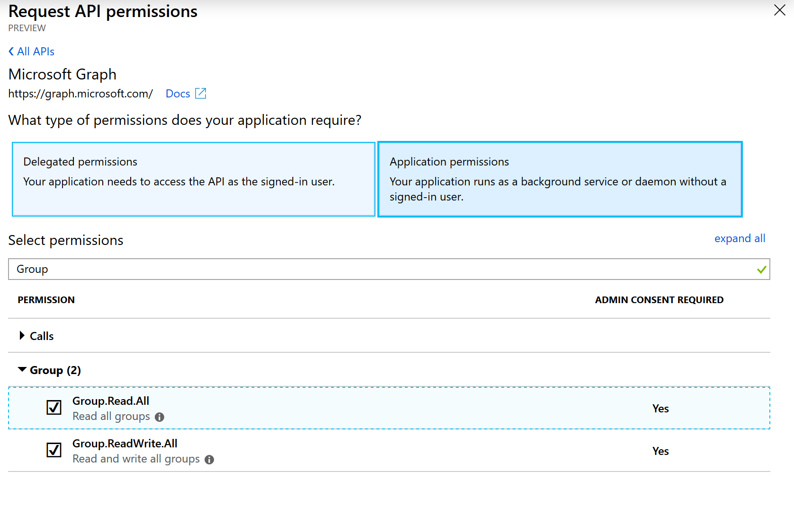
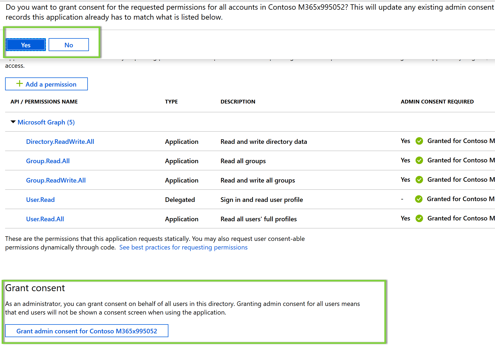

# Day 19 - Assign permissions to user using the unified groups

- [Day 19 - Add permissions to user](#day19-assign-permissions)
    - [Prerequisites](#prerequisites)
    - [Step 1: Update the App Registration permissions](#step-1-update-the-app-registration-permissions)
    - [Step 2: Extend the Program to manage user permissions to unified groups](#step-2-extend-the-program-to-manage-user-permissions-to-unified-groups)
        - [Create the PermissionHelper class](#create-the-permissionhelper-class)
        - [Extend program to add and validate user permissions to unified group](#extend-program-to-add-and-validate-user-permissions-to-unified-group)

## Prerequisites

To complete this sample you need the following:

- Complete the [Base Console Application Setup](../base-console-app/)
- [Visual Studio Code](https://code.visualstudio.com/) installed on your development machine. If you do not have Visual Studio Code, visit the previous link for download options. (**Note:** This tutorial was written with Visual Studio Code version 1.28.2. The steps in this guide may work with other versions, but that has not been tested.)
- [.Net Core SDK](https://www.microsoft.com/net/download/dotnet-core/2.1#sdk-2.1.403). (**Note** This tutorial was written with .Net Core SDK 2.1.403.  The steps in this guide may work with other versions, but that has not been tested.)
- [C# extension for Visual Studio Code](https://marketplace.visualstudio.com/items?itemName=ms-vscode.csharp)
- Either a personal Microsoft account with a mailbox on Outlook.com, or a Microsoft work or school account.

If you don't have a Microsoft account, there are a couple of options to get a free account:

- You can [sign up for a new personal Microsoft account](https://signup.live.com/signup?wa=wsignin1.0&rpsnv=12&ct=1454618383&rver=6.4.6456.0&wp=MBI_SSL_SHARED&wreply=https://mail.live.com/default.aspx&id=64855&cbcxt=mai&bk=1454618383&uiflavor=web&uaid=b213a65b4fdc484382b6622b3ecaa547&mkt=E-US&lc=1033&lic=1).
- You can [sign up for the Office 365 Developer Program](https://developer.microsoft.com/office/dev-program) to get a free Office 365 subscription.


## Step 1: Update the App Registration permissions

As this exercise requires new permissions the App Registration needs to be updated to include the **Directory.ReadWrite.All**, **Group.Read.All** and **Group.ReadWrite.All** permission using the new Azure AD Portal App Registrations UI (in preview as of the time of publish Nov 2018).

1. Open a browser and navigate to the [Azure AD Portal](https://aad.portal.azure.com). Login using a **personal account** (aka: Microsoft Account) or **Work or School Account** with permissions to create app registrations.

    > **Note:** If you do not have permissions to create app registrations contact your Azure AD domain administrators.

1. Click **Azure Active Directory** from the left-hand navigation menu.

1. Click on the **.NET Core Graph Tutorial** item in the list

    > **Note:** If you used a different name while completing the [Base Console Application Setup](../base-console-app/) select that instead.

1. Click **API permissions** from the current blade content.

    1. Click **Add a permission** from the current blade content.
    1. On the **Request API permissions** flyout select **Microsoft Graph**.

        

    1. Select **Application permissions**.
    1. In the "Select permissions" search box type "Directory".
    1. Select **Directory.Read.All** and**Directory.ReadWrite.All**from the filtered list.

        
    1. Go back to the "Select permissions" search box type and type "Group".  
    1. Select **Group.Read.All** and**Group.ReadWrite.All**from the filtered list.

             

    1. Click **Add permissions** at the bottom of flyout.

1. Back on the API permissions content blade, click **Grant admin consent for Contoso**.
**need new screenshot here**
    

    1. Click **Yes**.

## Step 2: Extend the program to manage user permissions to unified groups

### Create the ResultsItem Helper class
1. Create a new file in the `Helpers` folder called `ResultsItems.cs`.
1. Replace the contents of `ResultsItems.cs` with the following code:

    ```cs
    using System;
    using System.Collections.Generic;
    using System.Net.Http;
    using System.Threading.Tasks;
    using Microsoft.Graph;
    //Comment
    namespace ConsoleGraphTest
    {
        public class ResultsItem
        {

            // The ID and display name for the entity's radio button.
            public string Id { get; set; }
            public string Display { get; set; }

            // The properties of an entity that display in the UI.
            public Dictionary<string, object> Properties;

            public ResultsItem()
            {
                Properties = new Dictionary<string, object>();
            }
        }
    }
    ```
This class contains the helper class that will be used to hold the result data from various Microsoft Graph API calls and then used to iterate (if applicable) and show it in UI.

### Create the PermissionHelper class
In this step you will create a PermissionHelper class that encapsulates the logic for managing users permissions by virtue of adding them to Unified Groups.Then you will add calls to the console application created in the [Base Console Application Setup](../base-console-app/) to provision validate the user permissions through unified groups.

1. Create a new file in the `Helpers` folder called `PermissionHelper.cs`.
1. Replace the contents of `PermissionHelper.cs` with the following code:

    ```cs
    using System;
    using System.Collections.Generic;
    using System.Net.Http;
    using System.Threading.Tasks;
    using Microsoft.Graph;

    namespace ConsoleGraphTest
    {
        public class PermissionHelper
        {
            private GraphServiceClient _graphClient;
            private HttpClient _httpClient;
            public PermissionHelper(GraphServiceClient graphClient)
            {
                if (null == graphClient) throw new ArgumentNullException(nameof(graphClient));
                _graphClient = graphClient;
            }

            public PermissionHelper(HttpClient httpClient)
            {
                if (null == httpClient) throw new ArgumentNullException(nameof(httpClient));
                _httpClient = httpClient;
            }
            
            //Returns a list of groups that the given user belongs to
            public async Task<List<ResultsItem>> UserMemberOf(string alias)
            {
                User user = FindByAlias(alias).Result;
                List<ResultsItem> items = new List<ResultsItem>();

                IUserMemberOfCollectionWithReferencesPage groupsCollection = await _graphClient.Users[user.Id].MemberOf.Request().GetAsync();
                if (groupsCollection?.Count > 0)
                {
                    foreach (DirectoryObject dirObject in groupsCollection)
                    {
                        if (dirObject is Group)
                        {
                            Group group = dirObject as Group;
                            items.Add(new ResultsItem
                            {
                                Display = group.DisplayName,
                                Id = group.Id
                            });
                        }
                    }
                }
                return items;
            }

            //Adds the user to the given group if not already a member of
            public async Task AddUserToGroup(string alias, string groupId)
            {
                User user = FindByAlias(alias).Result;
                List<ResultsItem> items = UserMemberOf(alias).Result;
                if (items.FindIndex(f => f.Id == groupId) >= 0)
                    Console.WriteLine("User already belongs to this group");
                else
                    await _graphClient.Groups[groupId].Members.References.Request().AddAsync(user);
            }

            //Returns the first unified group with the given prefix
            public async Task<string> GetGroupByName(string groupNamePrefix)
            {
                var groups = await _graphClient.Groups.Request().Filter("groupTypes/any(c:c%20eq%20'unified') AND startswith(displayName,'" + groupNamePrefix + "')").Select("displayName,description,id").GetAsync();
                if (groups?.Count > 0)
                {
                    return (groups[0] as Group).Id as string;
                }
                return null;
            }

            //Creates a Unified O365 Group
            public async Task<string> CreateGroup()
            {
                string guid = Guid.NewGuid().ToString();
                string groupPrefix = "Contoso -";
                Group group = await _graphClient.Groups.Request().AddAsync(new Group
                {
                    GroupTypes = new List<string> { "Unified" },
                    DisplayName = groupPrefix + guid.Substring(0, 8),
                    Description = groupPrefix + guid,
                    MailNickname = groupPrefix.Replace(" ", "").ToLower() + guid.Substring(0, 8),
                    MailEnabled = false,
                    SecurityEnabled = false
                });
                if (null == group)
                    throw new ApplicationException($"Unable to create a unified group"); 
                
                return group.Id;
            }

            //Returns the User object for the given alias
            public async Task<User> FindByAlias(string alias)
            {
                List<QueryOption> queryOptions = new List<QueryOption>
                {
                    new QueryOption("$filter", $@"mailNickname eq '{alias}'")
                };

                var userResult = await _graphClient.Users.Request(queryOptions).GetAsync();
                if (userResult.Count != 1) throw new ApplicationException($"Unable to find a user with the alias {alias}");
                return userResult[0];
            }
        }
    }
    ```
This class contains the code to list all the groups a user belongs to, identify a unified group by prefix, add a user as a member to a unified group and thus provide permissions on the Office 365 and the corresponding SharePoint Online site. You will also find a method that creates a unified group with "Contoso -" as prefix.

>**Note:**The sample code attempts to create a unified group if it doesn't find a group with the prefix "Contoso". This might fail if your tenant is configured with a prefix requirement.

### Extend program to add and validate user permissions to unified group

1. Inside the `Program` class add below methods. with the following definition. The method `ListUnifiedGroupsForUser` identifies all the groups that the given user is a member of. The method `GetUnifiedGroupStartswith` returns the unified office 365 group id for a given group name prefix. The method `AddUserToUnifiedGroup` attempts to add the given user to the provided group. All these methods in turn invoke the methods in PermissionHelper class which uses Microsoft Graph SDK to make all the API calls. 

    ```cs
    private static void PermissionHelperExampleScenario()
    {

        const string alias = "adelev";
        ListUnifiedGroupsForUser(alias);
        string groupId = GetUnifiedGroupStartswith("Contoso");
        AddUserToUnifiedGroup(alias, groupId);
        ListUnifiedGroupsForUser(alias);
    }

    private static void ListUnifiedGroupsForUser(string alias)
    {
        var permissionHelper = new PermissionHelper(_graphServiceClient);
        List<ResultsItem> items = permissionHelper.UserMemberOf(alias).Result;
        Console.WriteLine("User is member of "+ items.Count +" group(s).");
        foreach(ResultsItem item in items)
        {
            Console.WriteLine("  Group Name: "+ item.Display);
        }
    }

    private static string GetUnifiedGroupStartswith(string groupPrefix)
    {
        var permissionHelper = new PermissionHelper(_graphServiceClient);
        var groupId = permissionHelper.GetGroupByName(groupPrefix).Result;
        return groupId;
    }
    private static void AddUserToUnifiedGroup(string alias, string groupId)
    {
        var permissionHelper = new PermissionHelper(_graphServiceClient);
        permissionHelper.AddUserToGroup(alias, groupId).GetAwaiter().GetResult();
    }
    ```
    > **Important** Any key things to note where the developer might run into issues.

1. Continuing in the `Main` method add the following code to execute the scenario that will be used to demonstrate how a user can be given permissions to a specific unified group and thus the SharePoint Online site using Microsoft Graph API. This method will first lits out the groups the user belongs to, then adds the user to a new unified group and then validates that the user is in fact added to the group.

    ```cs
    PermissionHelperExampleScenario();
    ```
1. Save all files.

The console application is now able to manage user permissions to unified groups and SharePoint Online sites by virtue of membership fo the groups. In order to test the console application run the following commands from the command line:

```
dotnet build
dotnet run
```

After running this sample scenario you have added a user to a new unified group (and hence a SharePoint Online site) and validated the above action.
