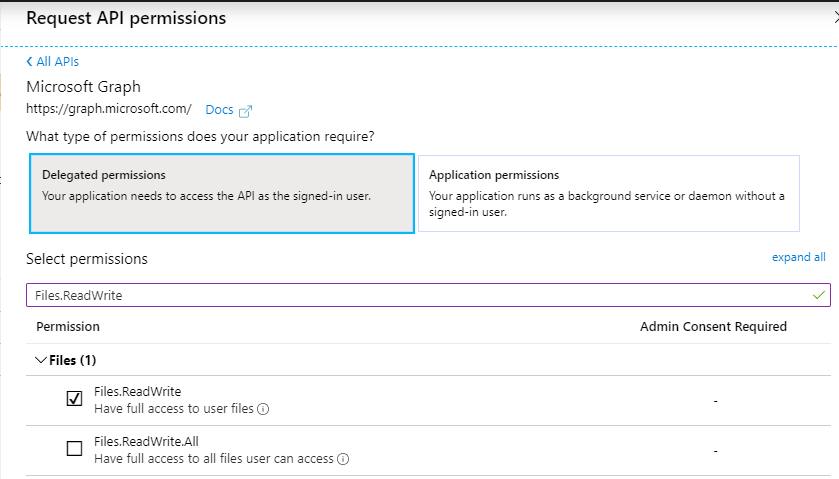
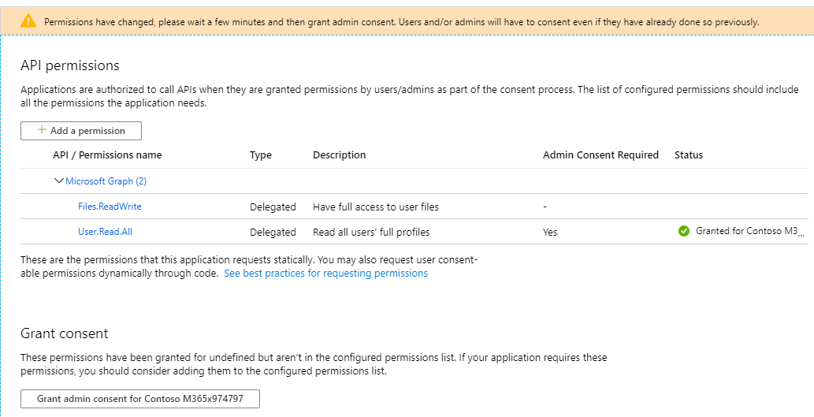

# Day 29 - Uploading Files to OneDrive

**Note:** This sample for uploading files to OneDrive via .Net Core APIs is a "bonus" and as such does not have complete documentation and possible inaccuracies.  Please excuse the incompleteness and enjoy the sample as it appears.

- [Day 29 - Uploading Files to OneDrive](#day-29---uploading-files-to-onedrive)
  - [Prerequisites](#prerequisites)
  - [Step 1: Update the App Registration permissions](#step-1-update-the-app-registration-permissions)
  - [Step 2: Enable your application for Device Code Flow](#step-2-enable-your-application-for-device-code-flow)
  - [Step 3: Implement the Device Code Flow in the application](#step-3-implement-the-device-code-flow-in-the-application)
    - [Create the DeviceCodeFlowAuthorizationProvider class](#create-the-devicecodeflowauthorizationprovider-class)
    - [Extend program to leverage this new authentication flow](#extend-program-to-leverage-this-new-authentication-flow)
    - [Update the reference to the MSAL library](#update-the-reference-to-the-msal-library)

## Prerequisites

To complete this sample you need the following:

- Complete the [Base Console Application Setup](../base-console-app/)
- [Visual Studio Code](https://code.visualstudio.com/) installed on your development machine. If you do not have Visual Studio Code, visit the previous link for download options. (**Note:** This tutorial was written with Visual Studio Code version 1.28.2. The steps in this guide may work with other versions, but that has not been tested.)
- [.Net Core SDK](https://www.microsoft.com/net/download/dotnet-core/2.1#sdk-2.1.403). (**Note** This tutorial was written with .Net Core SDK 2.1.403.  The steps in this guide may work with other versions, but that has not been tested.)
- [C# extension for Visual Studio Code](https://marketplace.visualstudio.com/items?itemName=ms-vscode.csharp)
- Either a personal Microsoft account with a mailbox on Outlook.com, or a Microsoft work or school account.

If you don't have a Microsoft account, there are a couple of options to get a free account:

- You can [sign up for a new personal Microsoft account](https://signup.live.com/signup?wa=wsignin1.0&rpsnv=12&ct=1454618383&rver=6.4.6456.0&wp=MBI_SSL_SHARED&wreply=https://mail.live.com/default.aspx&id=64855&cbcxt=mai&bk=1454618383&uiflavor=web&uaid=b213a65b4fdc484382b6622b3ecaa547&mkt=E-US&lc=1033&lic=1).
- You can [sign up for the Office 365 Developer Program](https://developer.microsoft.com/office/dev-program) to get a free Office 365 subscription.

## Step 1: Update the App Registration permissions

As this exercise requires new permissions the App Registration needs to be updated to include the **File.ReadWrite (delegated)** permission using the new Azure AD Portal App Registrations UI.

1. Open a browser and navigate to the [Azure AD Portal](https://aad.portal.azure.com). Login using a **personal account** (aka: Microsoft Account) or **Work or School Account** with permissions to create app registrations.

    > **Note:** If you do not have permissions to create app registrations contact your Azure AD domain administrators.

1. Click **Azure Active Directory** from the left-hand navigation menu.

1. Click on the **.NET Core Graph Tutorial** item in the list

    > **Note:** If you used a different name while completing the [Base Console Application Setup](../base-console-app/) select that instead.

1. Click **API permissions** from the current blade content.

    1. Click **Add a permission** from the current blade content.
    1. On the **Request API permissions** flyout select **Microsoft Graph**.

        

    1. Select **Delegated permissions**.
    1. In the "Select permissions" search box type "\<Start of permission string\>".
    1. Select **Files.ReadWrite.All** from the filtered list.

        

    1. Click **Add permissions** at the bottom of flyout.

1. Back on the API permissions content blade, click **Grant admin consent for \<name of tenant\>**.  
    

    1. Click **Yes**.  

    > **Note:** Make sure you do not have any application permission already selected, it will make the request fail. If you do have some, remove them before granting the new permissions.

## Step 2: Enable your application for Device Code Flow

1. On the application registration view from the last step, click on **Manifest**.
2. Set the `allowPublicClient` property to `true`.
3. Click on `Save`

## Step 3: Implement the Device Code Flow in the application

In this step you will create a UserHelper class that encapsulates the logic for creating users and finding user objects by alias and then add calls to the console application created in the [Base Console Application Setup](../base-console-app/) to provision a new user.

### Create the DeviceCodeFlowAuthorizationProvider class

1. Create a new file in the `Helpers` folder called `DeviceCodeFlowAuthorizationProvider.cs`.
1. Replace the contents of `DeviceCodeFlowAuthorizationProvider.cs` with the following code:

    ```cs
    using System;
    using System.Collections.Generic;
    using System.Net.Http;
    using System.Net.Http.Headers;
    using System.Threading.Tasks;
    using Microsoft.Graph;
    using Microsoft.Identity.Client;

    namespace ConsoleGraphTest {
        public class DeviceCodeFlowAuthorizationProvider : IAuthenticationProvider
        {
            private readonly PublicClientApplication _application;
            private readonly List<string> _scopes;
            private string _authToken;
            public DeviceCodeFlowAuthorizationProvider(PublicClientApplication application, List<string> scopes) {
                _application = application;
                _scopes = scopes;
            }
            public async Task AuthenticateRequestAsync(HttpRequestMessage request)
            {
                if(string.IsNullOrEmpty(_authToken))
                {
                    var result = await _application.AcquireTokenWithDeviceCodeAsync(_scopes, callback => {
                        Console.WriteLine(callback.Message);
                        return Task.FromResult(0);
                    });
                    _authToken = result.AccessToken;
                }
                request.Headers.Authorization = new AuthenticationHeaderValue("bearer", _authToken);
            }
        }
    }
    ```

This class contains the code to implement the device code flow requests when the `GraphServiceClient` requires an access token.

### Extend program to leverage this new authentication flow

1. Inside the `Program` class replace the last lines of the method `YourMethod` with the following lines.  This replaces references to leverage the Device Code Flow.

    ```cs
        var authority = $"https://login.microsoftonline.com/{config["tenantId"]}";

        List<string> scopes = new List<string>();
        scopes.Add("https://graph.microsoft.com/.default");

        var cca = new PublicClientApplication(clientId, authority);
        return new DeviceCodeFlowAuthorizationProvider(cca, scopes);
    ```

### Update the reference to the MSAL library

~~At the time of the writing, the Device Code Flow flow is only implemented in preview versions of the library.~~

1. In a command line type the following command `dotnet restore`.

The console application is now able to leverage the Device Code Flow which will allow the user to be identified and the context to bear a delegated context. In order to test the console application run the following commands from the command line:

```
dotnet build
dotnet run
```
